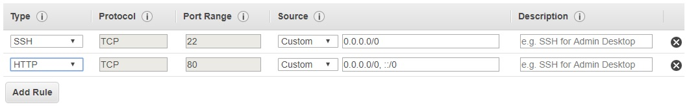
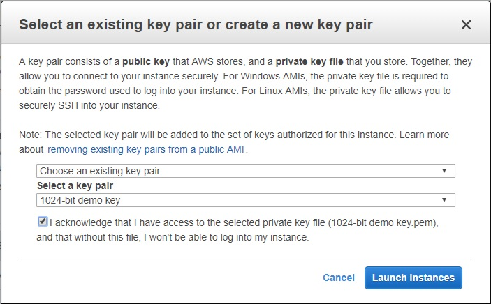

# Deploy AWS VM with Ubuntu Linux and Nginx server

In this tutorial , you learn how to deploy a functioning web server on AWS VMs using Ubuntu OS and Nginx web server.

## Prerequisites

To complete this tutorial, you will need:

- AWS subscription
- Pair of SSH authentication keys

Check the [Prerequisites](/docs/prerequisites.md) document how to obtain either.

## Import SSH keys

1. Log to AWS console
2. Go to the **EC2** section under Services - Compute Services
3. Select **Key Pairs** under Network & Security select Key Pair
4. Select **Import Key Pair**
5. Enter the chosen name for the Key pair
6. Insert your public key into the contents window
7. Select **Import** <details><summary>Show me how</summary></details>

## Launch the Instance

1. In AWS COnsole, go to the **EC2** section under Services - Compute Services
2. Select **Launch Instance**
3. Select **Ubuntu Server** at Step 1
4. Select **Next: Configure Instance Details** at Step 2 (keep *t2.micro* as a default instance type)
5. Extend the **Advanced Details** section at the bottom of the screen at Step 3
6. Insert into **User data** field the following configuration script:

```bash
#!/bin/bash
sudo apt install nginx -y
echo "<h1>Hello world from AWS VM!</h1>" | sudo tee /var/www/html/index.html
```

7. Select **Next: Add Storage** at the bottom of the screen of Step 3
8. Select **Next: Add Tags** at Step 4
9. Select **Next: Configure Security Group** at Step 5
10. Select **Add Rule** and select HTTP in a drop-down box for the new rule <details><summary>Show me how</summary></details>

11. Select **Review and Launch** at the bottom of the screen of Step 6
12. Select **Launch** at Step 7
13. Select your imported key at **Select a key pair** and check the checkbox <details><summary>Show me how</summary></details>

21. Select **Launch Instances** and start the deployment. It will take 3-5 minutes to initiate the instance.

## Test the web server

15. Go to the **EC2 **section under Services - Compute Services
16. Select **Instances** under Instances
17. Check the **IPv4 Public IP** of the newly created instance <details><summary>Show me how</summary>TBD</details>
18. Use the browser to load your functioning public web page using **http://your_IP_address**

## `SUCCESS!`

## Clean-up tasks

1. Go to the **EC2** section under Services - Compute Services
2. Right-click on the line with your instance
3. Select **Instance State** and choose **Terminate**
4. Acknowledge by selecting **Yes, Terminate**
